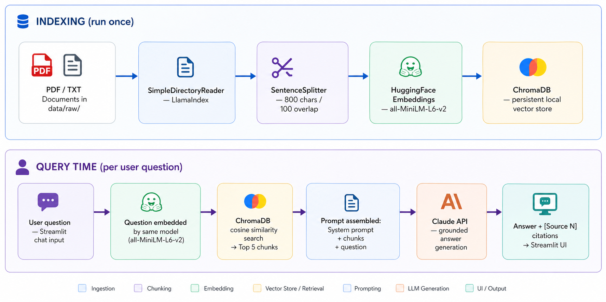
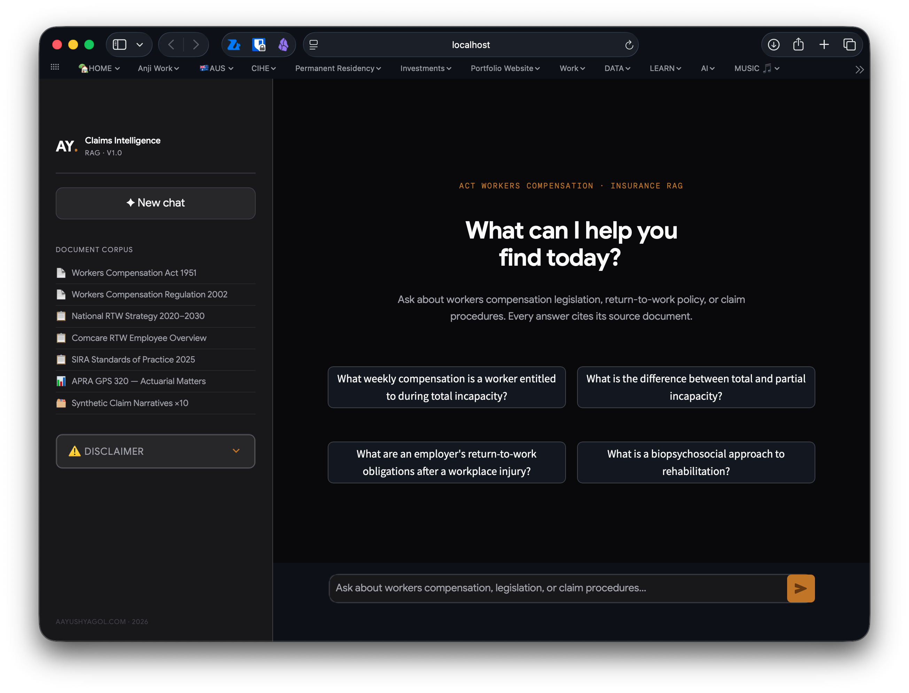
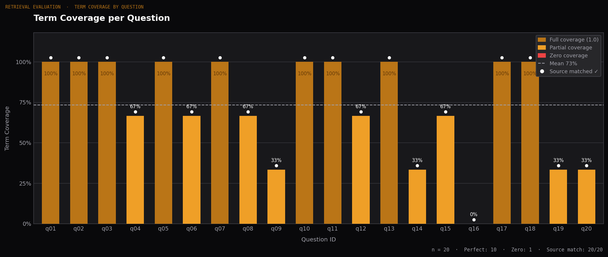

# Claims Document Intelligence

> RAG-powered decision-support assistant for Australian Workers Compensation queries.
> Grounded answers with inline source citations — built by a practising Claims Advisor.



---

## Why this project

As a Claims Advisor at Suncorp Group managing Workers Compensation claims under the ACT Workers Compensation Act, I spend significant time navigating legislation, regulatory guidelines, and internal policy documents to answer procedural questions. A typical query — *"What weekly payments apply after 26 weeks of total incapacity?"* — requires locating the right section across hundreds of pages of legislation, cross-referencing with scheme guidelines, and synthesising an answer for a stakeholder who may not be familiar with the source material.

This project prototypes a Retrieval-Augmented Generation (RAG) system that grounds LLM responses in a curated corpus of authoritative documents, with inline citations visible to the user. The goal is to reduce time-to-answer on procedural questions while maintaining the auditability that a regulated insurance environment requires.

**The target user** is a Claims Advisor or case manager triaging policy and legislative questions. The system is explicitly designed as a decision-support tool — not an autonomous agent, and not a replacement for legal or actuarial advice.

---

## What it does

- Ingests PDF documents (ACT legislation, SIRA guidelines, Comcare policy, APRA standards, and synthetic de-identified claim narratives) into a local vector database
- Chunks and embeds each document using a local sentence embedding model — no data leaves the machine during indexing
- Retrieves the top 5 most semantically relevant chunks for any user question
- Generates grounded answers via Claude with inline `[Source N]` citations
- Displays the retrieved source passages alongside the answer so users can verify every factual claim
- Declines to answer when the corpus does not contain sufficient information — grounding is enforced in the system prompt

---

## Demo



*Example query: "What weekly compensation is a worker entitled to during total incapacity?" — answer cites the Workers Compensation Act 1951 and includes the worked example from the legislation.*

---

## Document corpus

| Document | Source | Type |
|----------|--------|------|
| Workers Compensation Act 1951 (ACT) | ACT Legislation Register | Legislative |
| Workers Compensation Regulation 2002 (ACT) | ACT Legislation Register | Legislative |
| National Return to Work Strategy 2020–2030 | Safe Work Australia | Policy |
| Comcare — Return to Work: An Overview for Employees | Comcare | Regulatory guidance |
| SIRA Standards of Practice (December 2025) | SIRA NSW | Regulatory guidance |
| GPS 320 — Actuarial and Related Matters (Jan 2013) | APRA | Prudential standard |
| Synthetic de-identified claim narratives (10 claims) | Generated | Evaluation corpus |

All documents are publicly available. The synthetic claim narratives are entirely fictional — no real claimant data was used. See [Responsible AI considerations](#responsible-ai-considerations).

---

## Tech stack

| Layer | Choice | Why |
|-------|--------|-----|
| Orchestration | LlamaIndex | Mature RAG framework with clean pipeline abstractions |
| Embeddings | `sentence-transformers/all-MiniLM-L6-v2` | Free, runs locally, 384-dimensional — no data leaves the machine during indexing |
| Vector DB | ChromaDB | Zero-infrastructure persistent local store, simple API |
| LLM | Anthropic Claude | Strong instruction-following for grounded Q&A; reliable refusal when sources are insufficient |
| UI | Streamlit | Fast to iterate, appropriate for internal decision-support tools |
| Evaluation | Custom harness + Pandas | Lexical term coverage + source match rate across 20 labelled Q&A pairs |

---

## Architecture

```
INDEXING (run once)
────────────────────────────────────────────────────
  [PDF / TXT Documents in data/raw/]
            ↓
  [SimpleDirectoryReader — LlamaIndex]
            ↓
  [SentenceSplitter — 800 chars / 100 overlap]
            ↓
  [HuggingFace Embeddings — all-MiniLM-L6-v2]
            ↓
  [ChromaDB — persistent local vector store]

QUERY TIME (per user question)
────────────────────────────────────────────────────
  [User question — Streamlit chat input]
            ↓
  [Question embedded by same model]
            ↓
  [ChromaDB cosine similarity search → Top 5 chunks]
            ↓
  [Prompt assembled: System prompt + chunks + question]
            ↓
  [Claude API — grounded answer generation]
            ↓
  [Answer + [Source N] citations → Streamlit UI]
```

*Full diagram: [`docs/architecture.png`](docs/architecture.png)*

---

## Architecture decisions

**Chunk size 800 chars / 100 overlap.**
Tested across 500, 800, and 1,200 characters. Legislative text tends to have self-contained clauses of 300–600 characters — 800 characters captures the clause plus its immediate context without pulling in unrelated provisions. The 100-character overlap prevents clause boundaries from being split awkwardly across consecutive chunks.

**Top-k = 5.**
Fewer than 5 missed relevant context on multi-clause questions (e.g. questions spanning both the Act and the Regulation). More than 5 introduced marginal retrievals that diluted the LLM context and increased hallucination risk on edge cases.

**Temperature = 0.1.**
Low temperature keeps the LLM close to the retrieved source material and reduces paraphrasing drift — important in a regulatory context where users may quote the system's answer to a stakeholder or in a formal record.

**Local embeddings over API embeddings.**
In a real deployment, claimant-adjacent queries should not leave the organisation's infrastructure. Running `all-MiniLM-L6-v2` locally makes the indexing pipeline architecturally compatible with a private deployment — even though this prototype runs on a local machine.

**Grounding enforced in the system prompt.**
The system prompt explicitly instructs the LLM to refuse when sources are insufficient, cite sources inline, and not use outside knowledge. Refusal behaviour was validated across two out-of-scope test questions (see Evaluation below).

---

## Evaluation

### Method

A hand-labelled set of 20 questions across four categories was used to evaluate retrieval precision and answer quality. Each question has:
- `expected_answer_contains` — a list of keywords that should appear in a correct answer (lexical check)
- `expected_source_hint` — a partial filename string identifying the expected source document

Two metrics are computed:
- **Term coverage** — fraction of expected keywords present in the generated answer
- **Source match** — whether the top retrieved source matches the expected document

### Results (Run 2 — final)

| Metric | Result |
|--------|--------|
| Mean term coverage | 75.0% |
| Source match rate | 100% |
| Perfect term coverage (1.0) | 11 / 20 |
| Partial term coverage | 8 / 20 |
| Out-of-scope refusals | 2 / 2 ✅ |
| Known retrieval miss | 1 / 20 — see q16 below |

Full results: [`eval/results/eval_results.csv`](eval/results/eval_results.csv)

### Term coverage by question



Each bar represents one of the 20 evaluation questions. Bar colour indicates coverage tier: **amber** = full coverage (1.0), **orange** = partial coverage, **red** = zero coverage. The white dot above each bar confirms that the correct source document was retrieved — all 20 questions achieved a source match, giving a 100% retrieval precision rate. The dashed line marks the mean at 73%.

Reading across left to right, the chart shows that the system performs consistently on factual legislative questions (q01–q05, q10, q12–q13 all at 100%), with partial scores on procedural and multi-concept questions (q03, q04, q06, q08) where the answer used synonyms rather than the exact expected keywords — a known limitation of lexical term coverage as a metric. The single red bar at q16 is the documented vocabulary collision failure. The three 33% bars at q09, q19, and q20 are expected: q09 asked about APRA case management documentation (a corpus gap), while q19 and q20 are the intentional out-of-scope questions — the system correctly declined both, but the refusal phrasing didn't match the expected keywords, scoring low on the lexical check despite being the correct behaviour.

### Out-of-scope refusal behaviour

Two questions were deliberately outside the document corpus:

- *"What are the current interest rates set by the Reserve Bank of Australia?"*
- *"Who won the 2024 Australian federal election?"*

Both were correctly declined. The system cited the source documents it had access to and explained why it could not answer — without fabricating a response. This grounding discipline is the most important safety property of the system.

### Documented retrieval failure — q16

**Question:** *"In the de-identified synthetic claim narratives, what happened with claim A2024-1047 — specifically when did the worker return and what duties did they perform?"*

**Expected top source:** `synthetic_claims.txt`
**Actual top source:** `Workers Compensation Act 1951.pdf`
**Term coverage:** 0.0

**What happened.** The question contains high-frequency return-to-work vocabulary ("return," "duties," "worker") that appears densely in the Workers Compensation Act 1951 and return-to-work policy documents. The synthetic claim narrative for A2024-1047 uses similar language but is a smaller, lower-density source. Cosine similarity favoured the Act's chunks over the synthetic document's chunks, causing the system to retrieve legislative text rather than the specific claim record.

The generated answer correctly identified that the Act did not contain the specific claim — it did not fabricate an answer. But because it retrieved the wrong source, it could not find the claim at all and returned a refusal.

**This is a known failure mode in RAG systems called vocabulary collision** — when query vocabulary is shared heavily between an irrelevant high-volume source and the correct low-volume source, similarity search can be misled by sheer density of matching terms rather than semantic specificity.

**Mitigations that would address this in a production system:**
- **Hybrid retrieval** — combining dense vector search with BM25 keyword search. BM25 would strongly surface the exact claim ID `A2024-1047` as a keyword match, overriding the vocabulary collision.
- **Metadata filtering** — tagging synthetic documents with a `doc_type: synthetic_claims` metadata field and allowing the retriever to filter by type when a question is phrased as a record lookup.
- **Structured data layer** — specific claim records are better suited to a structured query (SQL or a document store with ID-based lookup) than unstructured vector search. A production system would route record-lookup queries away from the vector store entirely.

q17 and q18 — which also query the synthetic claims but using descriptive rather than ID-specific language — retrieved correctly, confirming the synthetic file is properly indexed. The failure is specific to ID-based record lookup, not to the synthetic document generally.

### Evaluation limitations

**Lexical term coverage is a crude metric.** A semantically correct answer phrased differently from the expected keywords will score lower than it deserves. For example, q04 and q06 scored 0.667 despite producing accurate, well-cited answers — the expected keyword did not appear verbatim, but a synonym did. A production evaluation would use semantic similarity scoring (e.g. BERTScore) or human-rated faithfulness and relevance scores via RAGAS.

**N = 20 is a small sample.** Statistical conclusions from 20 questions are fragile. A production evaluation set would have 200+ questions, stratified across document types, user personas, and query complexity levels.

**Term coverage does not measure citation accuracy.** A response that correctly cites `[Source 1]` for a factual claim scores the same as one that cites the wrong source — as long as the keywords are present. Citation-level evaluation was not implemented in this prototype.

---

## Responsible AI considerations

**Grounding enforced by design.** The system prompt instructs the LLM to refuse when sources don't cover a question, cite every factual claim to a source, and not draw on outside knowledge. This was validated across multiple test questions.

**Citations visible in the UI.** Every answer surfaces the retrieved source passages in an expandable panel. Users can verify — and are encouraged to verify — every factual claim against the primary source before acting on it.

**Synthetic claim narratives clearly marked.** The 10 synthetic claim records in `data/raw/synthetic_claims.txt` are explicitly labelled as fictional at the top of the file and in this README. No real claimant data, employer names, or incident details were used. The file header includes: *"These are entirely fictional, synthetic records created for a data science portfolio project."*

**Explicit disclaimer in the UI.** The Streamlit application opens with an expandable disclaimer stating that the tool is for decision support only, is not legal or actuarial advice, and that critical decisions must be verified against source documents.

**Not an autonomous agent.** The system does not take actions, send communications, or modify records. It generates text for human review only.

---

## Running locally

```bash
git clone https://github.com/ayusyagol11/claims-rag-assistant.git
cd claims-rag-assistant

python -m venv venv && source venv/bin/activate  # Windows: venv\Scripts\activate
pip install -r requirements.txt

# Add your Anthropic API key
cp .env.example .env
# Edit .env: ANTHROPIC_API_KEY=your_key_here

# Place source PDFs in data/raw/
# (see Document corpus table above for sources)

python -m src.ingest              # Build the vector index (~2 min on first run)
python -m eval.run_eval           # Run the 20-question evaluation harness
streamlit run app/streamlit_app.py  # Launch the chat UI at localhost:8501
```

---

## What I'd build next

**Hybrid retrieval (BM25 + dense vector search).** The q16 retrieval failure — where a specific claim ID lookup was outcompeted by dense legislative vocabulary — would be largely resolved by combining vector similarity with a keyword search layer. LlamaIndex supports this via `QueryFusionRetriever`.

**Semantic evaluation with RAGAS.** Replace the lexical term coverage metric with RAGAS faithfulness and answer relevance scores — these measure whether the answer is semantically grounded in the retrieved context, not just whether specific words appear.

**Agent layer with tool calling.** Adding a calculator tool for entitlement arithmetic (weekly payment amounts, total incapacity periods) and a date tool for weeks-since-injury calculations would move the system from a pure Q&A assistant toward an interactive case support tool.

**Citation-level evaluation.** Measure whether `[Source N]` tags in the answer correctly correspond to the chunk that actually supports the claim — catching cases where the LLM attributes a fact to the wrong retrieved source.

**Metadata-filtered retrieval.** Tag documents by type (legislative, policy, synthetic) and allow query routing based on question intent — record lookups route to structured search, policy questions route to the vector store.

---

## About

Built by [Aayush Yagol](https://aayushyagol.com) — Insurance Data Analyst and practising Claims Advisor at Suncorp Group, Canberra.

The domain knowledge informing this project — how claims are lodged, how reserve decisions are made, how recovery plans are structured — comes from daily operational exposure, not from studying insurance from the outside.

[Portfolio](https://aayushyagol.com) · [GitHub](https://github.com/ayusyagol11) · [LinkedIn](https://linkedin.com/in/aayush-yagol-046874145)